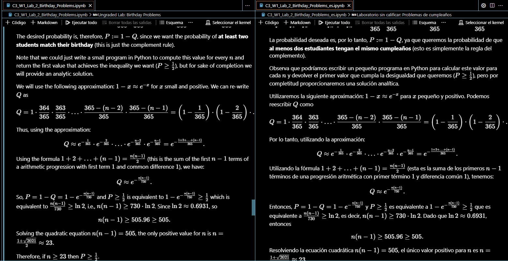

# Traductor de Notebooks de Jupyter

Este repositorio contiene un script de Python que permite traducir notebooks de Jupyter a diferentes idiomas.

El script utiliza el API de OpenAI para realizar las traducciones.

## Instalación

Para instalar el script, clone el repositorio y ejecute el siguiente comando:

```bash
pip install -r requirements.txt
```
## Uso

Para traducir un notebook, ejecute el siguiente comando:

```bash
python traductor_notebook.py <archivo_notebook> <idioma>
```

El script creará un nuevo archivo llamado `mi_notebook_es.ipynb` con la traducción del notebook.



## Contribuciones

Si desea contribuir al proyecto, puede enviar un pull request con sus cambios.

## Licencia

El proyecto está licenciado bajo la licencia MIT.